# Using the Just Eat Website

### 
Riana Franklin Allen

### 
April 8, 2020, updated February 2, 2025

## Introduction
With the spread of Covid-19 and the Coronavirus, more people are in self-isolation than ever 
before. This leaves many people, especially our older generation, in a bit of a quandary if 
they have relied on the local pubs and cafes for some or all their meals. The elderly are 
also the most likely to struggle with technology and how it can benefit them. This is a set 
of simple instructions meant to help the most basic user create an account, log in, and find 
a restaurant from one of the most popular food delivery apps in the United Kingdom, Just Eat.

### Signing up 
Use these steps to create an account. If you already have an account, skip to the next section 
on [logging in](#logging-in).
1.  Open any web browser and type [just-eat.co.uk](just-eat.co.uk) into the navigation bar
and press the Enter key.  
    -  This will bring you to the Just Eat homepage.

<figure>
	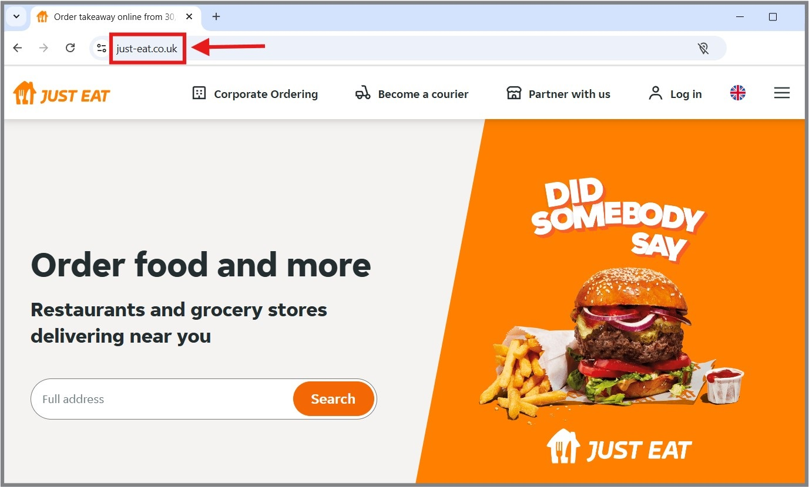
</figure>

2.  Click the “Log in” link in the upper right corner.
<figure>
	
</figure>

3.  Click the “Create an Account” button under the "Log in" button.
<figure>
	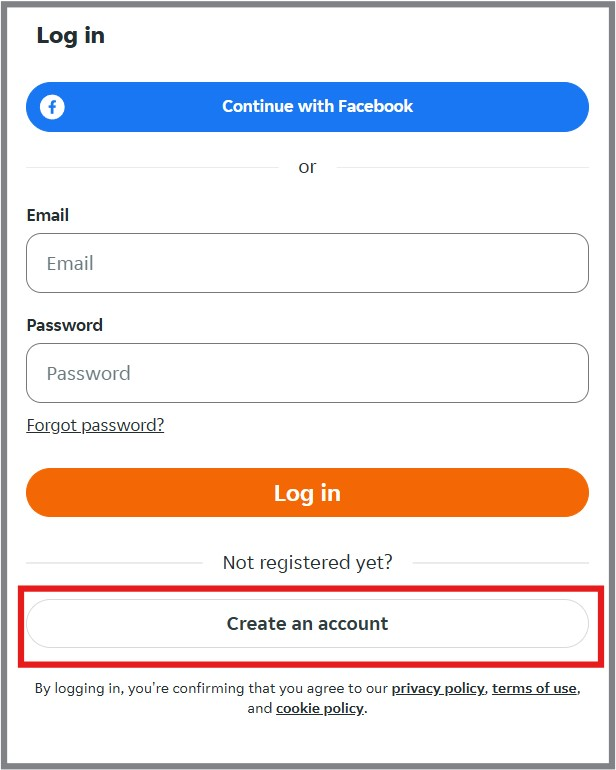
</figure>
4.  There are two options for creating an account:

#### Option A
Use your Facebook account to log in.

**Note:** *This option can only be used if you already have a Facebook 
account and are currently signed in.*

   -  Click on the “Continue with Facebook” button. 
<figure>
	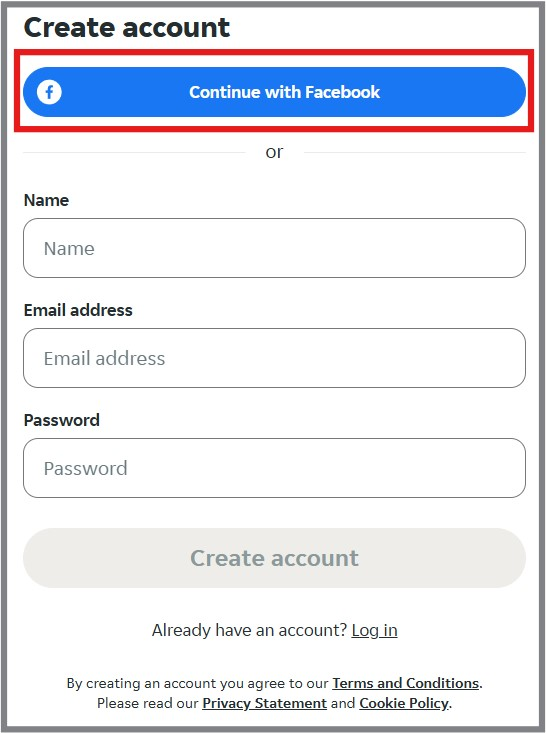
</figure>
    -  This will log you in immediately using your Facebook credentials and 
   will open a pop-up window with your Account Information
<figure>
	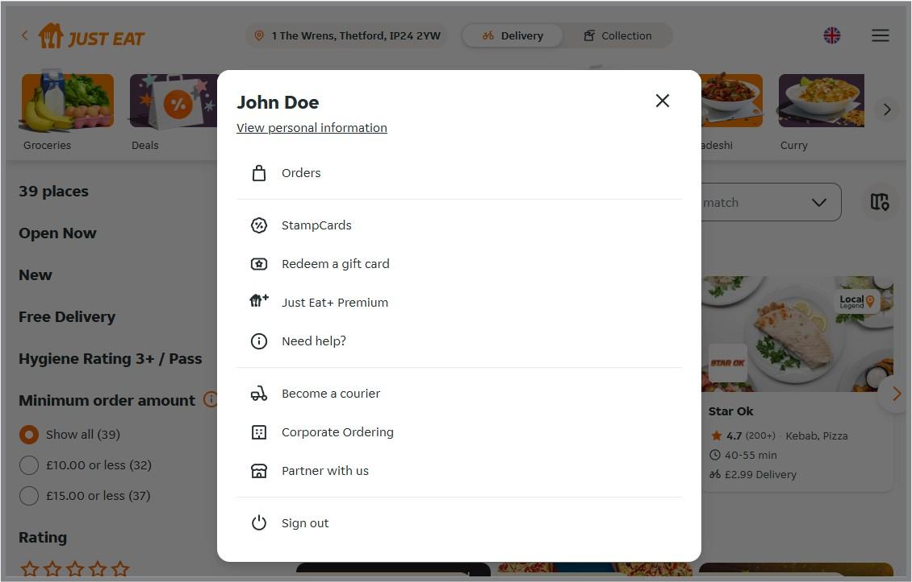
</figure>

#### Option B
Create an account with your email.

  -  Type in your name, email address, and a password you will remember. 
<figure>
	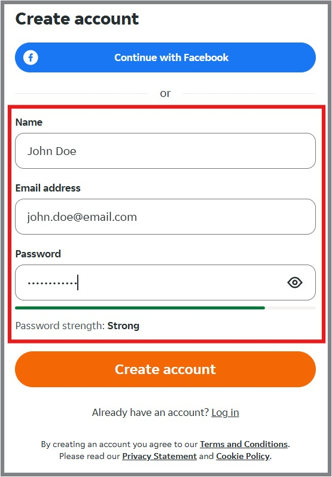
</figure>

   -  The strength of your password will be shown under your password as you type.
<figure>
	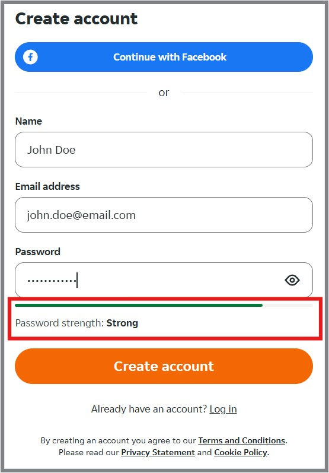
</figure>
	
6.  Click the “Create Account” button to register.
    -  You will be signed in and brought back to the Just Eat homepage.
<figure>
	
</figure>

7.  Signing up will open a pop-up window with your Account Information
<figure>
	
</figure>

### Logging in 
Use these steps after an account has been created. See the [previous section](#signing-up) for how to 
create an account.
1.  Open any web browser and type [“just-eat.co.uk”](just-eat.co.uk) into the navigation bar 
and press the "Enter" key.
   - This will bring you to the Just Eat homepage.
<figure>
	
</figure>

2.   Click the “Log in” link in the upper right corner.
<figure>
	
</figure>

3.  Depending on how you created your account, there are two options for logging in to 
an account:

#### Option A
If you created your account with your Facebook login, make sure you are currently 
logged in to Facebook. 
    -  Click the “Continue with Facebook” button.
<figure>
	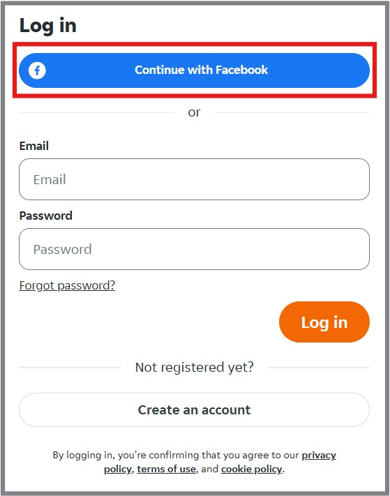
</figure>
    -  This will immediately log you in using your Facebook Credentials

#### Option B 
If you created your account with your email and password, use the following steps:
    -  Enter your email and password information
<figure>
	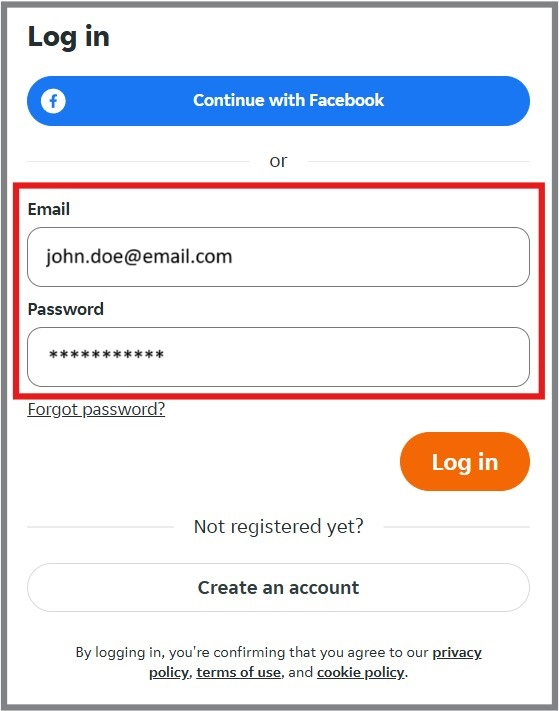
</figure>
    -  Click the "Log in" button
<figure>
	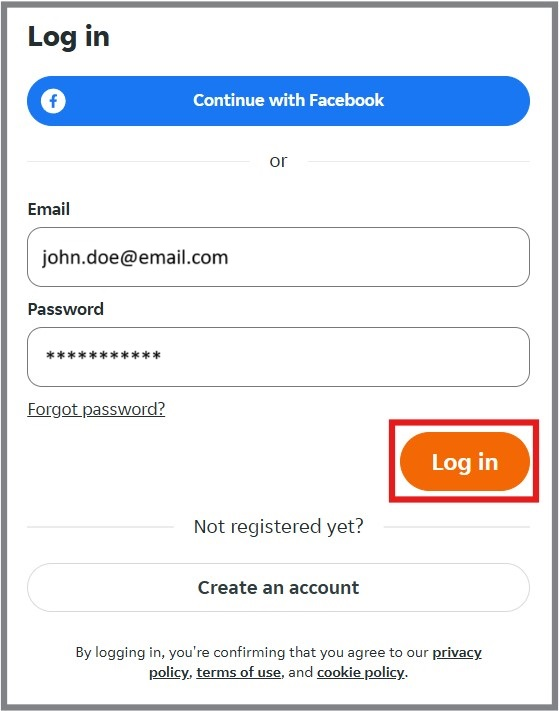
</figure>

4. Either login path will bring up the Just Eat homepage and a pop-up window with Account Information.
<figure>
	
</figure>
		
5.  You can verify you are logged in at any time by checking the account information.
    -  Clicking on the hamburger icon in the upper right corner of the screen will bring up
the same pop-up window with Account Information.
<figure>
	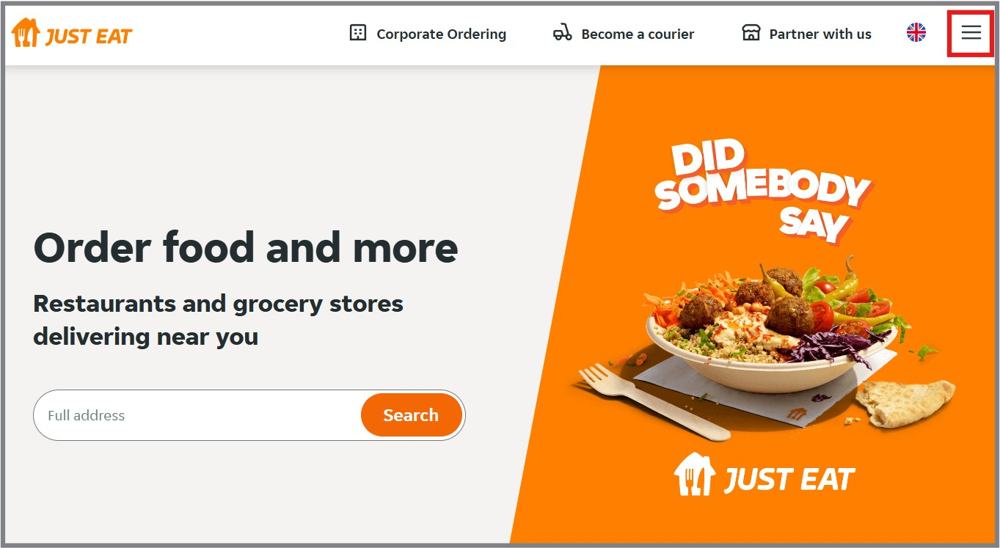
</figure>

### Password Reset
If you forget your password, you can reset this from the Login screen.
1.  Open any web browser, type [just-eat.co.uk](just-eat.co.uk) into the navigation
bar, and press the enter key.  
    -  This will bring you to the Just Eat homepage.
<figure>
	
</figure>

2.  Click the “Log in” link in the upper right corner.
<figure>
	
</figure>

3.  Click the "Forgot Password" link below the login information.
<figure>
	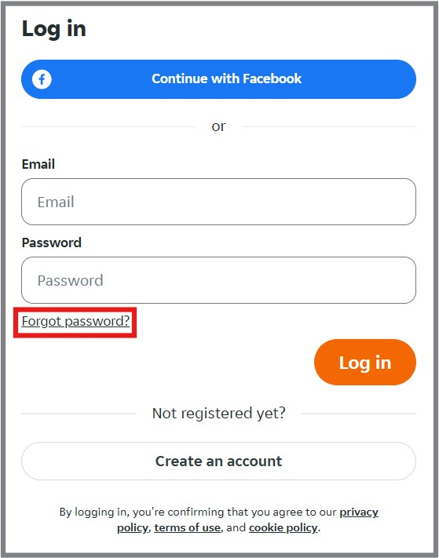
</figure>

4.  This will bring up a pop-up window asking if you have forgotten your password.
    -  Type your email address in the correct field and click the "Reset your Password"
     button.
<figure>
	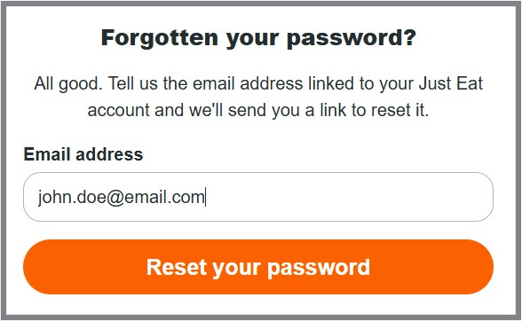
</figure>
5.  If an account has been created for this email address, an email will be sent
with a password reset link.
<figure>
	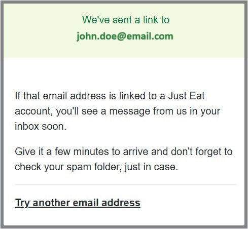
</figure>

6.  Open the associated email account and find the email from Just Eat.
    -  Click on the link in the email
<figure>
	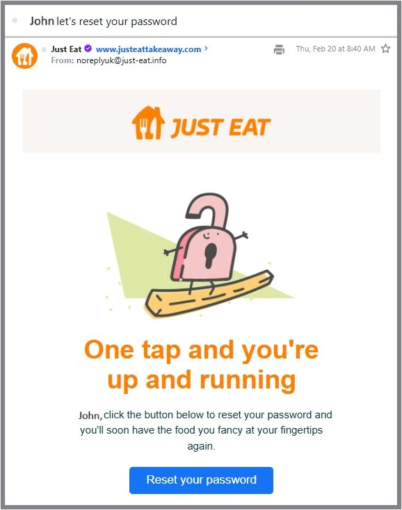
</figure>

7.  Type your new password in both open fields and click the "Save your new
password" button.
<figure>
	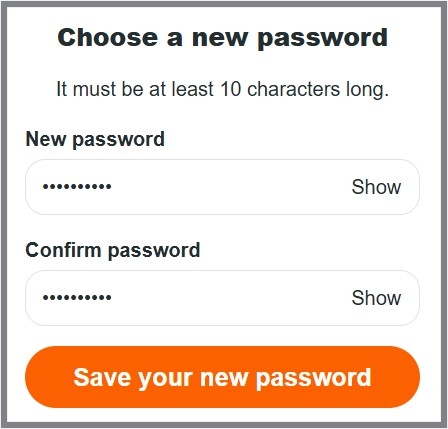
</figure>

8.  Once submitted, a new pop-up screen will appear, noting that the change
has been accepted.
    -  Click the "Log in" button and follow the steps in the [Logging In](#logging-in) section.
<figure>
	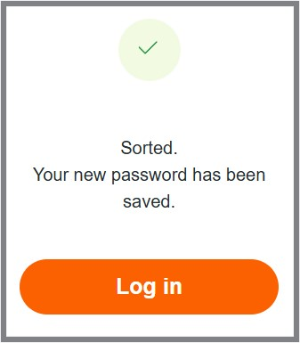
</figure>

### Finding a Restaurant 
Once you have [created an account](#signing-up) and [logged in](#logging-in), you can 
find a restaurant from which to order.

1.  Open any web browser, type [just-eat.co.uk](just-eat.co.uk) into the navigation
bar, and press the enter key.  
    -  This will bring you to the Just Eat homepage.
<figure>
	
</figure>

2.  Log in as indicated in the [Logging in](#logging-in) section.

3.  Type your address in the search bar.
   -  As you type, a drop-down of related addresses will populate.
<figure>
	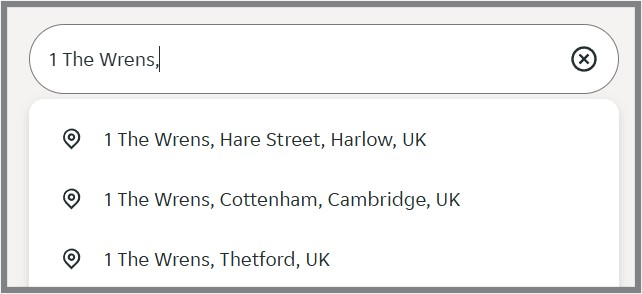
</figure>
    -  Select your address and click the "Search" button.  
<figure>
	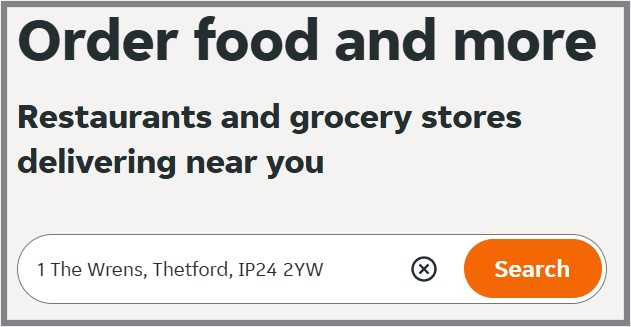
</figure> 
	
4.  You will be brought to a list of restaurants that 
service your address.
<figure>
	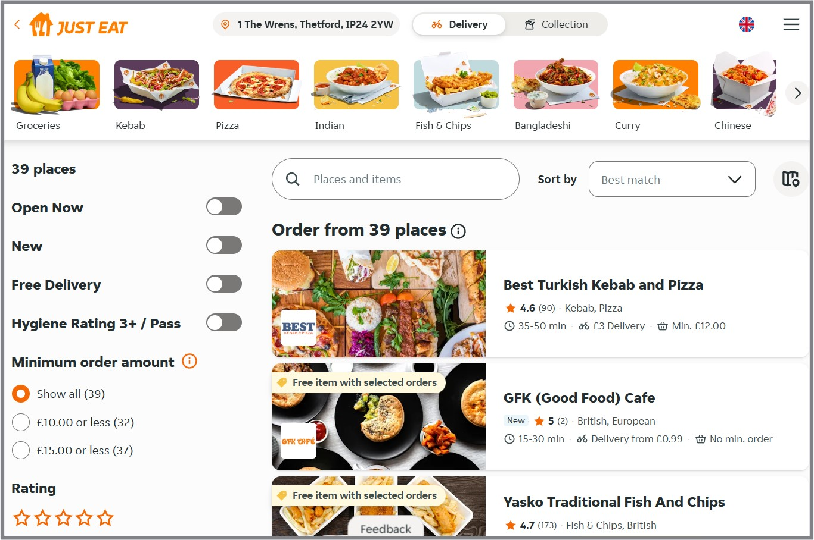
</figure>

5.  Search for specific types of cuisines either by picking from the “Popular 
Cuisines” options at the top of the page,
<figure>
	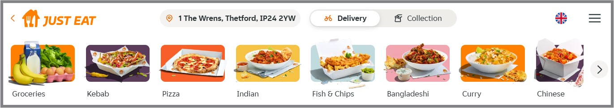
</figure>

*or* filter search results from the list on the left side of the page.
<figure>
	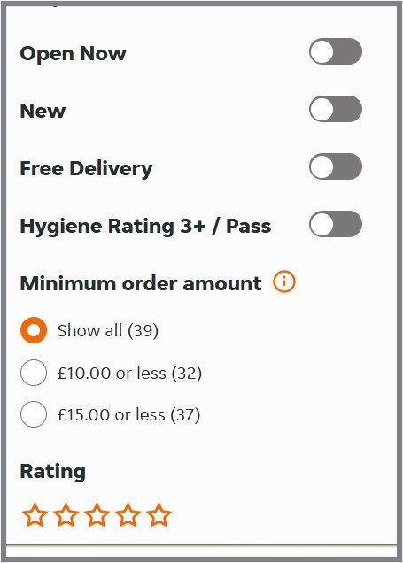
</figure>

6. Restaurants can also be searched by name, and the search results can
the sorted in the fields above the results.
    -  Restaurants are sorted by “Best Match” by default.
<figure>
	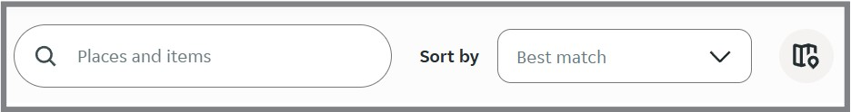
</figure>

7.  The resulting restaurants will populate below that field.
<figure>
	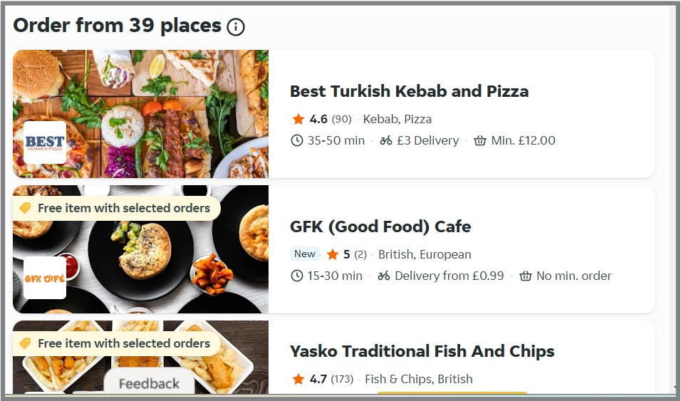
</figure>

9.  Select the restaurant you want to order from and click on it.
   - You will be taken to that restaurant’s page.
<figure>
	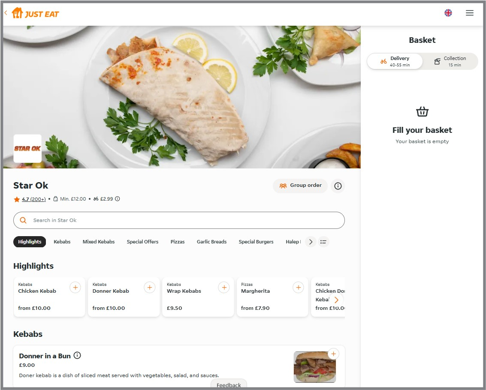
</figure>

### Ordering

1.  On the Restaurant's page found in the [previous](#finding-restaurants)
section, pick your desired food
<figure>
	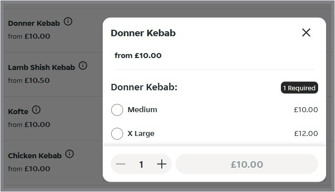
</figure>

2.  Select any required options.
<figure>
	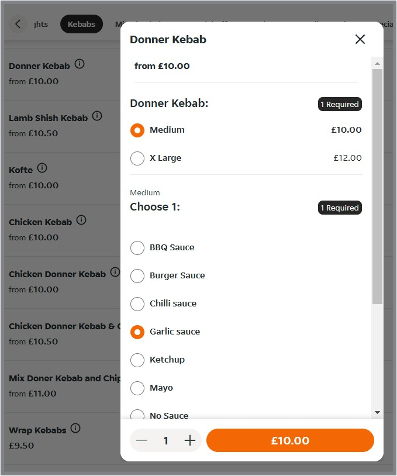
</figure>

3.  Once the desired food has been selected, review the basket on the
right of the screen.
<figure>
	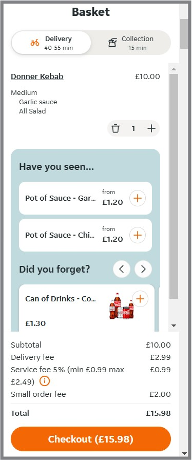
</figure>

4.  At the top of the Basket, you can toggle between delivery
or collection.
    - Both will show the time until it is available.
<figure>
	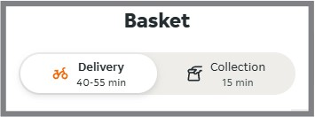
</figure>

5.  Review the fees and total and click the "Checkout" button.
<figure>
	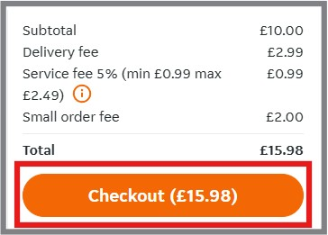
</figure>

6.  On the Checkout screen, review the delivery address and
personal information.
<figure>
	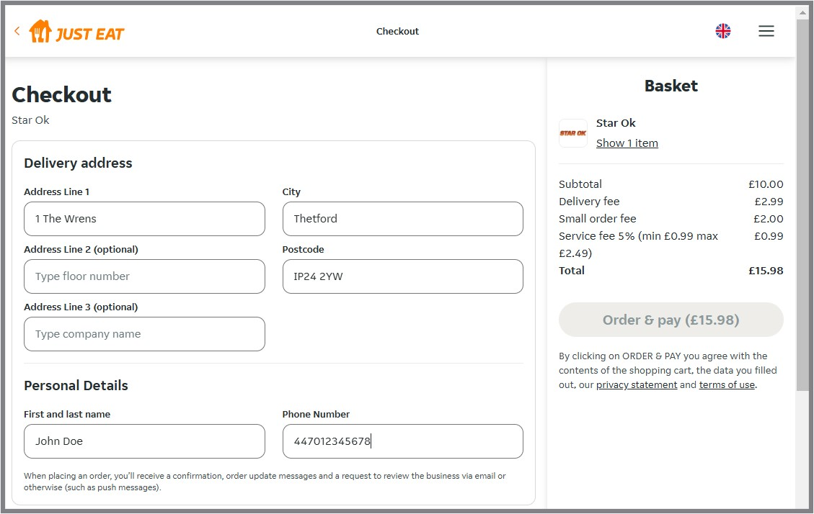
</figure>

7.  Scroll down to review the delivery time, order notes, and how
the payment will be made.
<figure>
	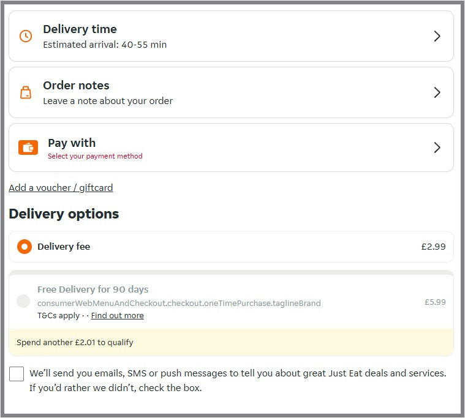
</figure>
    -  Order notes, such as where at the address the order should 
be delivered, can be added by clicking on that section.
<figure>
	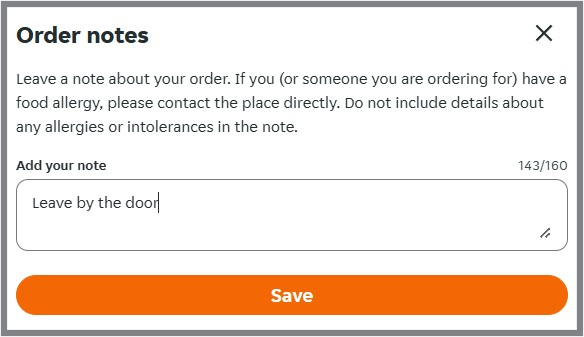
</figure>
    -  Select the payment method and determine how you 
will pay for the order and click the "Done" button.
<figure>
	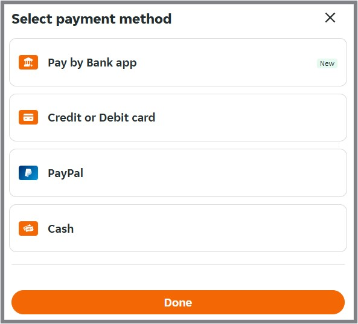
</figure>

8.  If you do not want to receive emails and text message offers,
check the small box at the bottom of the screen.
<figure>
	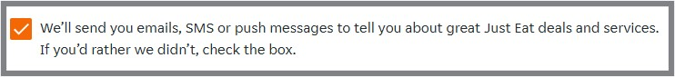
</figure>

9.  Review the order in the basket to the right. Once it has been
reviewed, click the "Order & Pay" button.
<figure>
	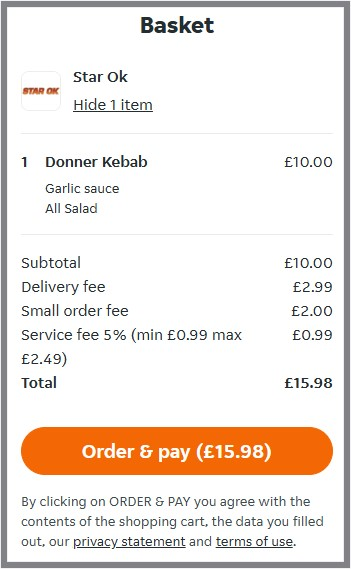
</figure>

10.  Once the order is placed, you will be redirected to a confirmation
screen with the information about your order.
<figure>
	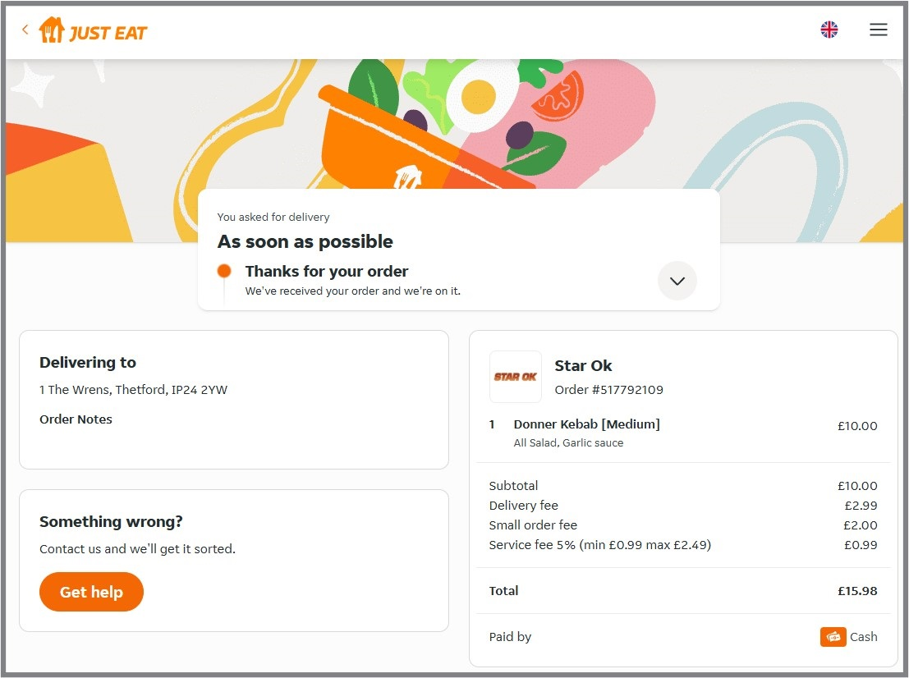
</figure>

### Sign Out
Once you have placed your order, you can sign out
1. Click on the hamburger icon in the upper right corner of the page
<figure>
	
</figure>
2. At the bottom of the pop-up screen, select the "Sign Out" option
<figure>
	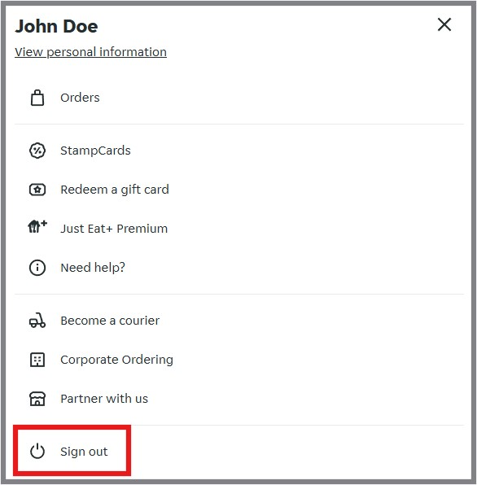
</figure>
