# Using the Just Eat Website

### 
Riana Franklin Allen

### 
April 8, 2020

## Introduction
With the spread of Covid-19 and the Coronavirus, more people are in self-isolation than ever 
before. This leaves many people, especially our older generation, in a bit of a quandary if 
they have relied on the local pubs and cafes for some or all their meals. The elderly are 
also the most likely to struggle with technology and how it can benefit them. This is a set 
of simple instructions meant to help the most basic user create an account, log in, and find 
a restaurant from one of the most popular food delivery apps in the United Kingdom, Just Eat.

### Signing up 
Use these steps to create an account. If you already have an account, skip to the next section 
on logging in.
1.  Open any web browser and type [just-eat.co.uk](just-eat.co.uk) into the navigation bar
and press the Enter key.  
   a.  This will bring you to the Just Eat homepage.
<figure>
	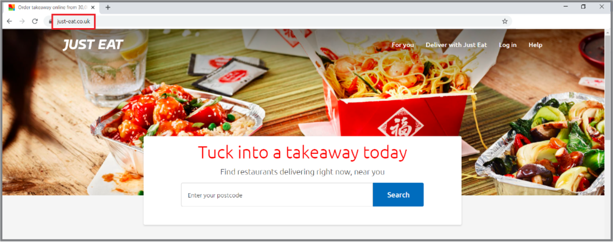
</figure>

2.  Click the “Log in” link in the upper right corner.
<figure>
	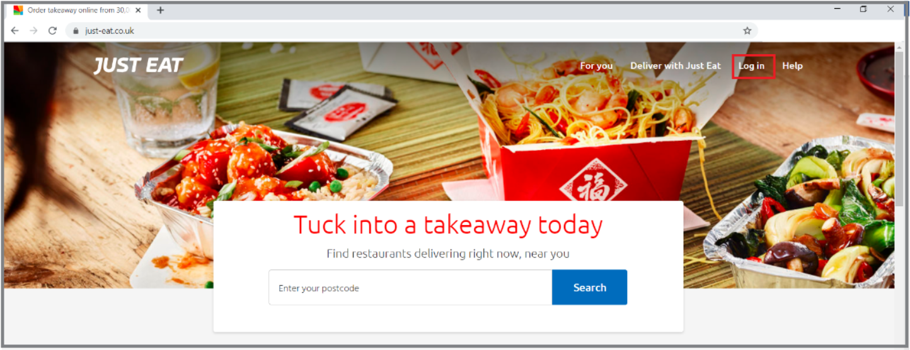
</figure>

3.  Click the “Sign up” link under the login button.
<figure>
	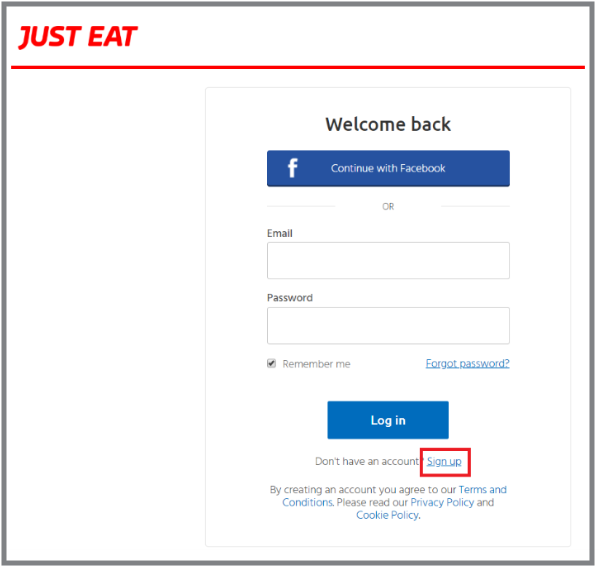
4.  There are two options for creating an account.

#### Option A
Use your Facebook account to log in.
    a.  Click on the “Continue with Facebook” button. 
:memo: **Note:** Only use this option if you 
already have a Facebook account and are currently signed in.
<figure>
	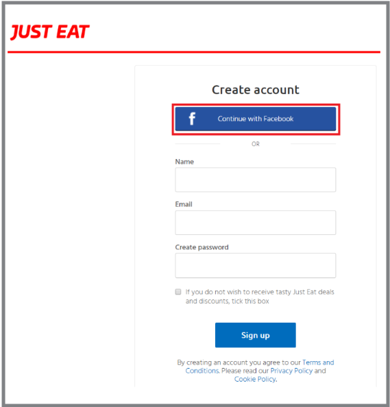
    b.  This will log you in immediately using your Facebook credentials.

#### Option B
Create an account with your email.
    a.  Type in your name, email address, and a password you will remember. 
<figure>
	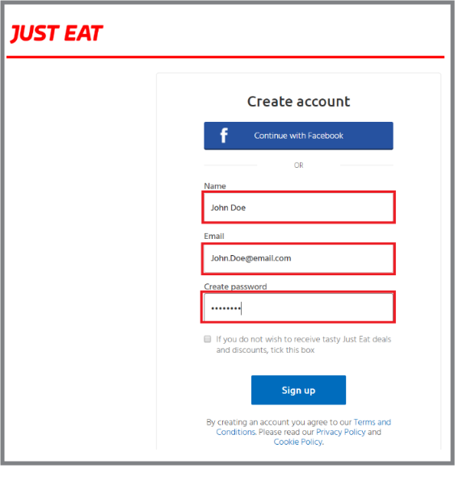

5.  For either option, click this small box if you do not want notifications
or additional offers via email.
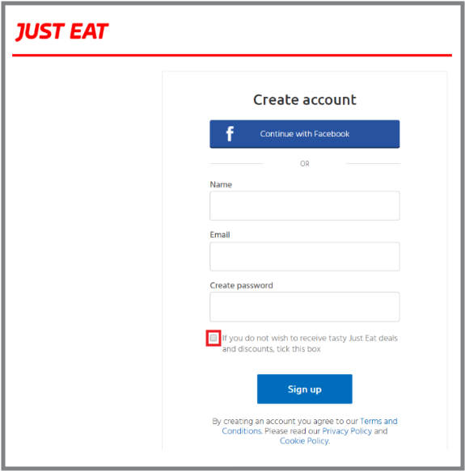
<figcaption>Figure 1.4.b.II - Do not receive offers</figcaption>

6.  Click the “Sign up” button to register. You will be signed in and brought back to
the Just Eat homepage.
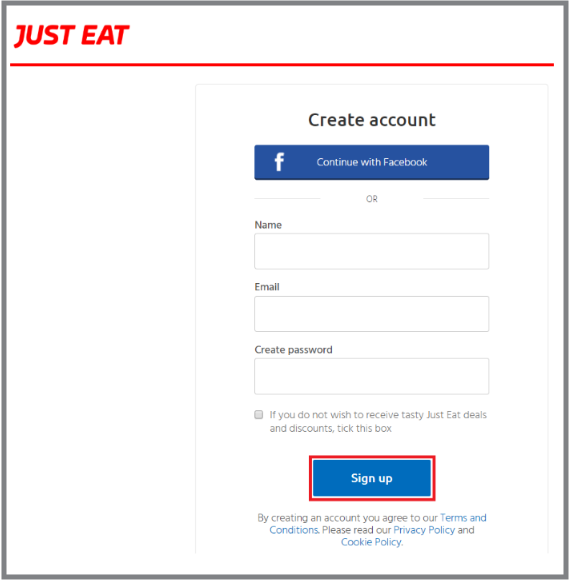
<figcaption>Figure 1.4.b.III – Sign up button</figcaption>

7.  You can verify you are logged in by checking that your name is in the top right corner.
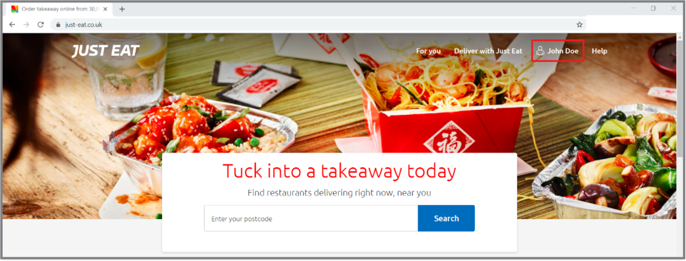
<figcaption>Figure 1.5 – Verify Login</figcaption>

### Logging in 
Use these steps after an account has been created. See the [previous section](#signing-up) for how to 
create an account.
1.  Open any web browser and type [“just-eat.co.uk”](just-eat.co.uk) into the navigation bar 
and press enter.
    a.  This will bring you to the Just Eat homepage.

<figcaption>Figure 2.1 – Navigate to Just Eat Home page</figcaption>

2.  Click the “Log in” link in the upper right corner.

<figcaption>Figure 2.2 Just Eat log in location</figcaption>

3.  Depending on how you created your account, there are two options for logging in to 
an account.

#### Option A
    a. If you created your account with your Facebook login, make sure you are currently 
logged in to Facebook. 
    b.  Click the “Continue with Facebook” button. 

<figcaption>Figure 2.3.a – Facebook login</figcaption>

#### Option B 
    a. If you created your account with your email and password, use the following steps:
    b. Enter your email and password information.
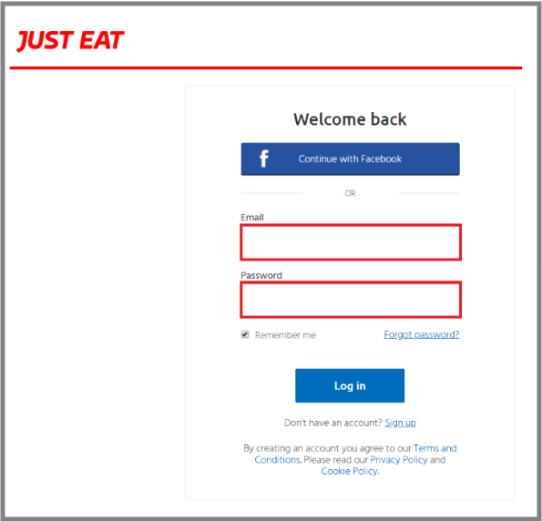
<figcaption>Figure 2.3.b.I – Email and Password</figcaption>

4.  For either option, if you want to reduce the number of times you must log in, 
keep the “Remember me” box checked. 
    a.  If you would like to log in each time, uncheck this box.
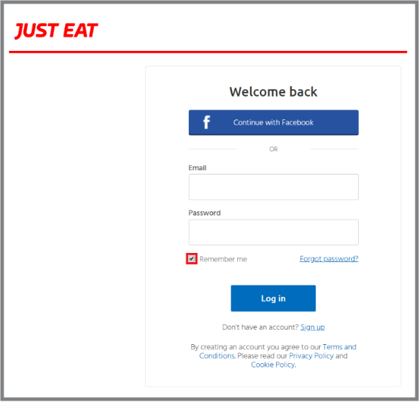
<figcaption>Figure 2.3.b.II – Remember me box</figcaption>

5.  Click the “Log in” button.
    a. You will be signed in and brought back to the Just Eat homepage.

<figcaption>Figure 2.2.b.III – Login button</figcaption>

6.  You can verify you are logged in by checking for your name in the top right corner.

<figcaption>Figure 2.4 – Verify Login</figcaption>

### Finding Restaurants 
Once you have [created an account](#signing-up) and [logged in](#logging-in), you can 
find a restaurant from which to order.

1.  Open any web browser, type [just-eat.co.uk](just-eat.co.uk) into the navigation
bar, and press the enter key.  
    a. This will bring you to the Just Eat homepage.

<figcaption>Figure 3.1 – Navigate to Just Eat Home page</figcaption>

2.  Verify you have created an account and are logged in. 

<figcaption>Figure 3.2 – Verify Login</figcaption>

3.  Enter your postcode in the search bar. 
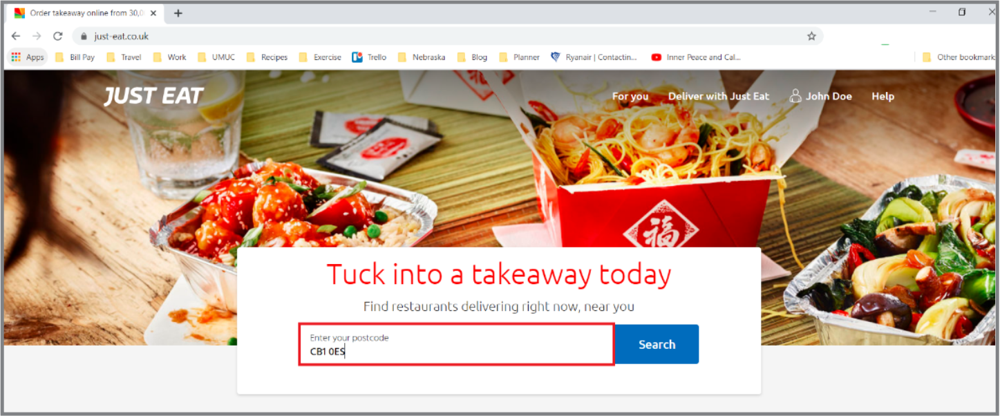
<figcaption>Figure 3.3 – Enter postcode</figcaption>
	
4.  Click the “Search” button.
    a.  You will be brought to a list of restaurants that 
service your postcode.
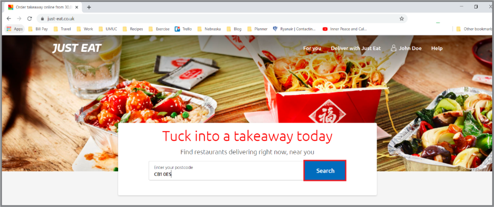
<figcaption>Figure 3.4 – Seach button</figcaption>

5.  Search for specific types of cuisines either by picking from the “Popular 
Cuisines” options at the top of the page,
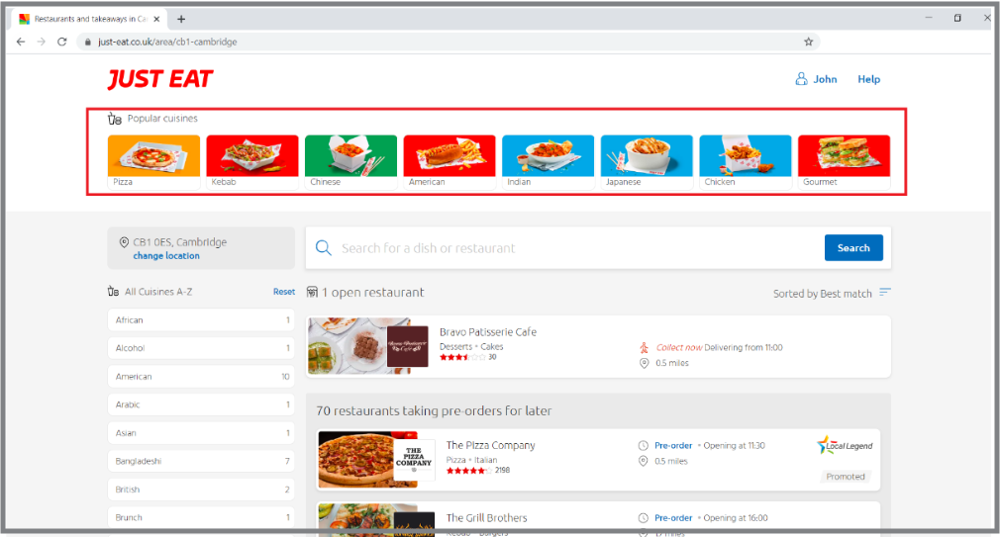
<figcaption>Figure 3.5.a – Popular cuisines</figcaption>

*or* select from a more detailed listing on the left side of the page.
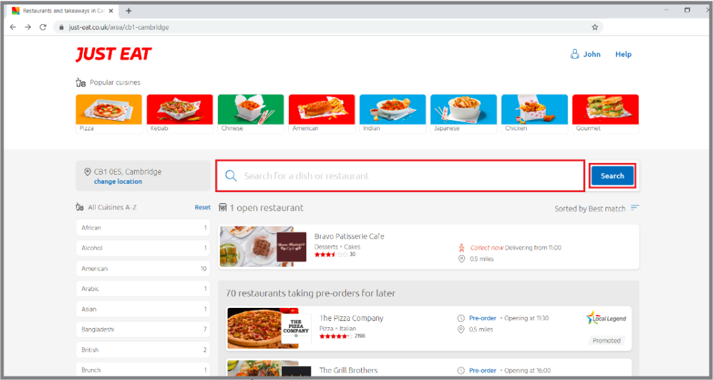
<figcaption>Figure 3.5.b – All cuisines</figcaption>

*Currently open restaurants are listed at the top.*
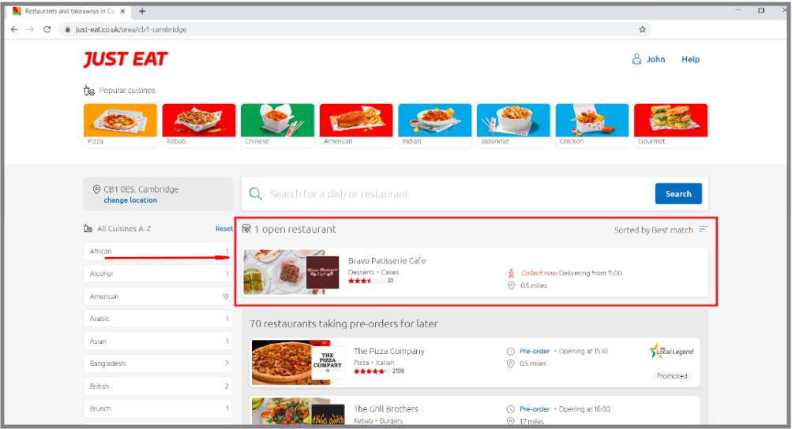
<figcaption>Figure 3.5.c – Open restaurants</figcaption>

6.  Change how the restaurants are sorted by hovering over the sorting option and 
selecting a different option.
    a. Restaurants are sorted by “Best Match” by default.
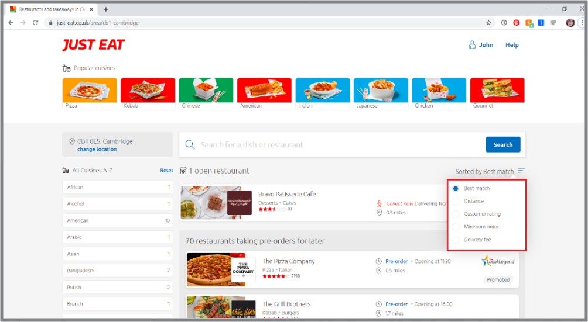
<figcaption>Figure 3.6 – Sort options</figcaption>

7.  Search restaurants by typing the name of the restaurant or the dish you would 
like into the search bar and clicking the "Search" button.

<figcaption>Figure 3.7 – Search for restaurants or dishes</figcaption>

8.  Find the restaurant you want to order from and click on it.
    a.  You will be taken to that restaurant’s page.
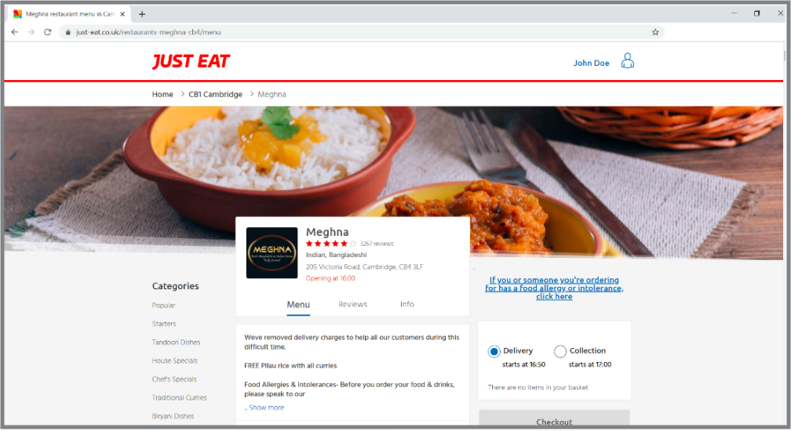
<figcaption>Figure 3.8 – Restaurant’s page</figcaption>
