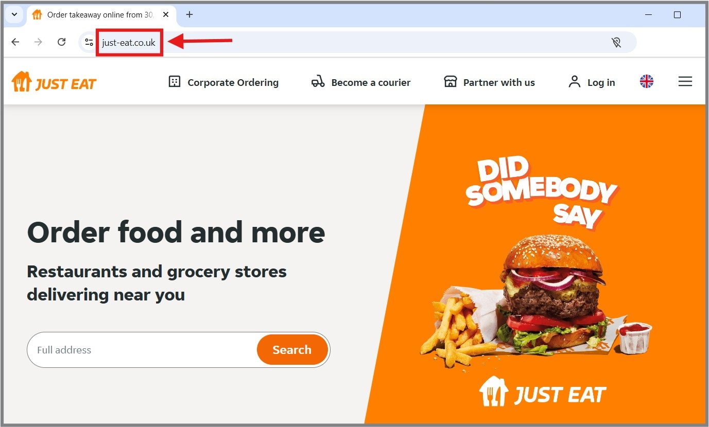
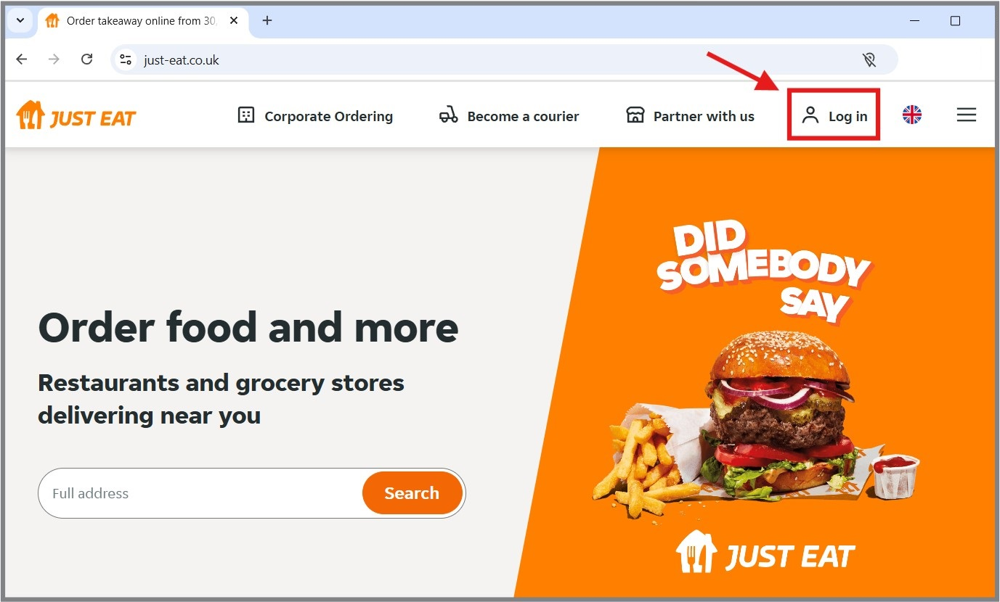
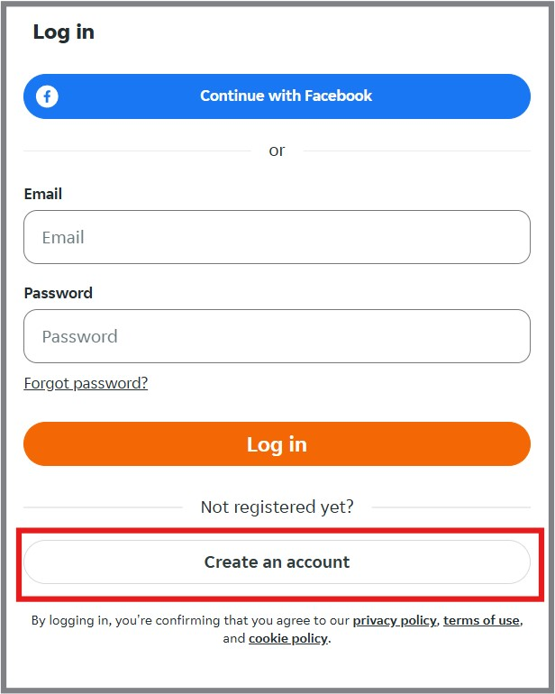
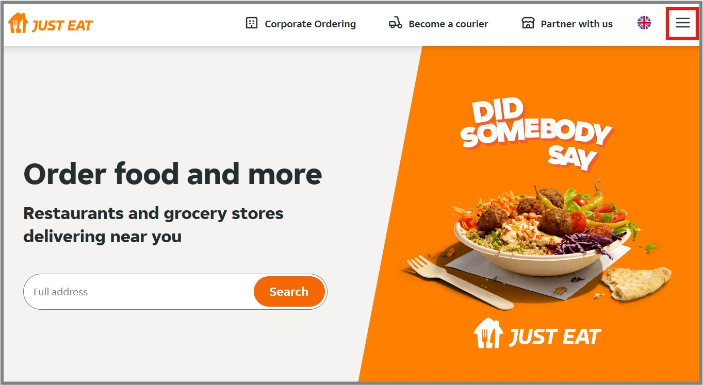
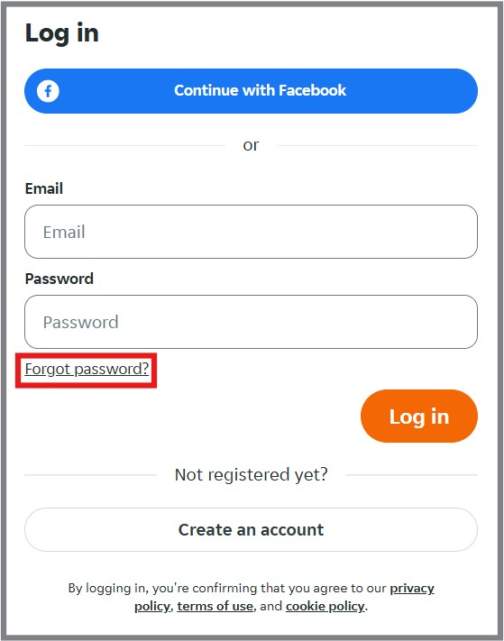

# Using the Just Eat Website

### 
Riana Franklin Allen

### 
April 8, 2020, updated February 2, 2025

## Introduction
With the spread of Covid-19 and the Coronavirus, more people are in self-isolation than ever 
before. This leaves many people, especially our older generation, in a bit of a quandary if 
they have relied on the local pubs and cafes for some or all their meals. The elderly are 
also the most likely to struggle with technology and how it can benefit them. This is a set 
of simple instructions meant to help the most basic user create an account, log in, and find 
a restaurant from one of the most popular food delivery apps in the United Kingdom, Just Eat.

### Signing up 
Use these steps to create an account. If you already have an account, skip to the next section 
on [logging in](#logging-in).
1. Open any web browser and type [just-eat.co.uk](just-eat.co.uk) into the navigation bar
and press the Enter key.  
   - This will bring you to the Just Eat homepage.
<figure>
	
</figure>

2. Click the “Log in” link in the upper right corner.
<figure>
	
</figure>

3. Click the “Create an Account” button under the "Log in" button.
<figure>
	
</figure>
4.  There are two options for creating an account:

#### Option A
Use your Facebook account to log in.

**Note:** *This option can only be used if you already have a Facebook 
account and are currently signed in.*

   - Click on the “Continue with Facebook” button. 
<figure>
	
</figure>
   - This will log you in immediately using your Facebook credentials and 
   will open a pop-up window with your Account Information
<figure>
	
</figure>

#### Option B
Create an account with your email.

   - Type in your name, email address, and a password you will remember. 
<figure>
	
</figure>

   - The strength of your password will be shown under your password as you type.
<figure>
	
</figure>
	
6. Click the “Create Account” button to register.
   - You will be signed in and brought back to the Just Eat homepage.
<figure>
	
</figure>

7. Signing up will open a pop-up window with your Account Information
<figure>
	
</figure>

### Logging in 
Use these steps after an account has been created. See the [previous section](#signing-up) for how to 
create an account.
1. Open any web browser and type [“just-eat.co.uk”](just-eat.co.uk) into the navigation bar 
and press the "Enter" key.
   - This will bring you to the Just Eat homepage.
<figure>
	
</figure>

2.  Click the “Log in” link in the upper right corner.
<figure>
	
</figure>

3.  Depending on how you created your account, there are two options for logging in to 
an account:

#### Option A
If you created your account with your Facebook login, make sure you are currently 
logged in to Facebook. 
   - Click the “Continue with Facebook” button.
<figure>
	
</figure>
   - This will immediately log you in using your Facebook Credentials

#### Option B 
If you created your account with your email and password, use the following steps:
   - Enter your email and password information.
<figure>
	
</figure>

   - Click the “Log in” button.
<figure>
	
</figure>

4. Either login path will bring up the Just Eat homepage and a pop-up window with Account Information.
<figure>
	
</figure>
		
5.  You can verify you are logged in at any time by checking the account information.
    - Clicking on the hamburger icon in the upper right corner of the screen will bring up
the same pop-up window with Account Information.
<figure>
	
</figure>

### Password Reset
If you forget your password, you can reset this from the Login screen
1. Open any web browser, type [just-eat.co.uk](just-eat.co.uk) into the navigation
bar, and press the enter key.  
   - This will bring you to the Just Eat homepage.
<figure>
	
</figure>

2.  Click the “Log in” link in the upper right corner.
<figure>
	
</figure>

3. Click the "Forgot Password" link below the login information.
<figure>
	
</figure>
### Finding Restaurants 
Once you have [created an account](#signing-up) and [logged in](#logging-in), you can 
find a restaurant from which to order.

1. Open any web browser, type [just-eat.co.uk](just-eat.co.uk) into the navigation
bar, and press the enter key.  
   - This will bring you to the Just Eat homepage.
<figure>
	
</figure>

2.  Verify you have created an account and are logged in. 
<figure>
	
</figure>

3.  Enter your postcode in the search bar.
<figure>
	
</figure> 
	
4. Click the “Search” button.
   - You will be brought to a list of restaurants that 
service your postcode.
<figure>
	
</figure>

5.  Search for specific types of cuisines either by picking from the “Popular 
Cuisines” options at the top of the page,
<figure>
	
</figure>

*or* select from a more detailed listing on the left side of the page.
<figure>
	
</figure>

*Currently open restaurants are listed at the top.*
<figure>
	
</figure>

6. Change how the restaurants are sorted by hovering over the sorting option and 
selecting a different option.
   - Restaurants are sorted by “Best Match” by default.
<figure>
	
</figure>

7. Search restaurants by typing the name of the restaurant or the dish you would 
like into the search bar and clicking the "Search" button.
<figure>
	
</figure>

8. Find the restaurant you want to order from and click on it.
   - You will be taken to that restaurant’s page.
<figure>
	
</figure>
